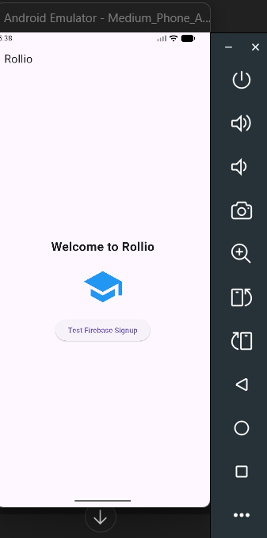

````markdown
# Rollio – Mobile Version (Sprint 2)

## 📌 Project Overview

Rollio is a cross-platform mobile application built using Flutter & Dart as part of Sprint 2. This version focuses on establishing a scalable architecture, understanding Flutter fundamentals, and implementing a clean, modular UI structure that will support future Firebase integrations.

---

## 🎯 Objective of This Task

* Set up Flutter development environment
* Understand project folder structure
* Build a custom Welcome UI using StatefulWidget
* Implement basic state management using setState()
* Create structured project documentation and architecture overview

---

## 🛠 Tech Stack

* Flutter (UI Framework)
* Dart (Programming Language)
* Firebase (Future Integration – Auth, Firestore, Storage)

---

## 📂 Folder Structure

```
lib/
 ┣ main.dart              # Entry point of the application
 ┣ screens/               # Contains full UI screens
 ┃   ┗ welcome_screen.dart
 ┣ widgets/               # Reusable UI components (future use)
 ┣ models/                # Data models (future use)
 ┣ services/              # Firebase & API logic (future use)
 ┗ utils/                 # Helper utilities (future use)
```

### 🔎 Structure Explanation

* **main.dart** → Initializes the app and loads the root widget.
* **screens/** → Contains complete UI pages such as Welcome, Login, Dashboard.
* **widgets/** → Reusable components like custom buttons or cards.
* **models/** → Data structures representing entities (e.g., Student, Task).
* **services/** → Business logic layer for Firebase or API interactions.
* **utils/** → Helper functions and utility classes.

This modular structure supports scalability, maintainability, and clean separation of concerns.

---

## 🚀 Setup Instructions

1. Install Flutter SDK
2. Run:

   ```
   flutter doctor
   ```
3. Clone this repository
4. Navigate into the project folder
5. Run:

   ```
   flutter pub get
   flutter run
   ```

---

## 🖥 UI Implementation

The default counter app was replaced with a custom Welcome Screen that includes:

* Scaffold with AppBar
* Column layout with consistent spacing
* Text widget with dynamic state
* Icon widget with color toggle
* ElevatedButton with onPressed event

### 🧠 State Management

The app uses a StatefulWidget to demonstrate reactive UI updates.

When the button is pressed:

* Text content changes
* Icon color toggles

This is handled using:

```
setState(() {
  isClicked = !isClicked;
});
```

Flutter rebuilds only the affected widget tree efficiently.

---

## 📸 Demo Screenshot

*Add your emulator screenshot here*

```

```

---

# 📘 API Documentation

## Documentation Method

Postman Collection (Recommended for Firebase-based apps)

### Metadata

* Version: 1.0.0
* Base URL: [https://your-app.firebaseapp.com](https://your-app.firebaseapp.com)
* Authentication: Firebase Token
* Last Updated: 2025-11-13

The Postman collection is available inside:

```
/docs/flutter_firebase_postman.json
```

This collection includes:

* Firebase Authentication (Sign Up / Login)
* Firestore CRUD operations
* Storage upload examples

---

# 🏗 Architecture Overview

## 🔹 System Overview

Tech Stack:

* Flutter (Frontend)
* Dart (Language)
* Firebase Authentication
* Cloud Firestore
* Firebase Storage

---

## 🔄 High-Level Data Flow

User Interaction → Flutter UI → Firebase Service → Response → UI Update

For real-time updates:

Firestore → Stream → StreamBuilder → Widget Rebuild

---

## 📊 Architecture Diagram (Conceptual)

```
User
  ↓
Flutter UI (Screens & Widgets)
  ↓
Services Layer
  ↓
Firebase Auth / Firestore / Storage
  ↓
Real-time Stream Response
  ↓
UI Rebuild
```

---

## 🚢 Deployment Strategy

To build release APK:

```
flutter build apk
```

For onboarding new developers:

1. Install Flutter SDK
2. Clone repo
3. Add Firebase config file (google-services.json)
4. Run flutter pub get
5. Run flutter run

---

# 🧠 Reflection

Through this task, I understood how Flutter’s widget-based architecture enables declarative UI building. Separating screens, widgets, and services prepares the project for scalable growth.

Using StatefulWidget and setState() demonstrated how Flutter rebuilds UI reactively instead of manually updating components.

Creating API documentation and architecture files reinforced the importance of structured development and maintainable design for future scaling.

---

# 📌 How Documentation Helps Scale

If this Flutter app grows into a large-scale product:

* Clear architecture reduces onboarding time for new developers.
* Versioned API documentation prevents confusion in endpoint usage.
* Modular folder structure avoids tight coupling.
* Explicit metadata ensures long-term consistency.

Well-documented systems scale faster and break less.

````
# Rollio – Mobile Version (Sprint 2)

## 📌 Project Overview

Rollio is a cross-platform mobile application built using Flutter & Dart as part of Sprint 2. This version focuses on establishing a scalable architecture, understanding Flutter fundamentals, and implementing a clean, modular UI structure that will support future Firebase integrations.

---

## 🎯 Objective of This Task

* Set up Flutter development environment
* Understand project folder structure
* Build a custom Welcome UI using StatefulWidget
* Implement basic state management using setState()
* Create structured project documentation and architecture overview

---

## 🛠 Tech Stack

* Flutter (UI Framework)
* Dart (Programming Language)
* Firebase (Future Integration – Auth, Firestore, Storage)

---

## 📂 Folder Structure

```
lib/
 ┣ main.dart              # Entry point of the application
 ┣ screens/               # Contains full UI screens
 ┃   ┗ welcome_screen.dart
 ┣ widgets/               # Reusable UI components (future use)
 ┣ models/                # Data models (future use)
 ┣ services/              # Firebase & API logic (future use)
 ┗ utils/                 # Helper utilities (future use)
```

### 🔎 Structure Explanation

* **main.dart** → Initializes the app and loads the root widget.
* **screens/** → Contains complete UI pages such as Welcome, Login, Dashboard.
* **widgets/** → Reusable components like custom buttons or cards.
* **models/** → Data structures representing entities (e.g., Student, Task).
* **services/** → Business logic layer for Firebase or API interactions.
* **utils/** → Helper functions and utility classes.

This modular structure supports scalability, maintainability, and clean separation of concerns.

---

## 🚀 Setup Instructions

1. Install Flutter SDK
2. Run:

   ```
   flutter doctor
   ```
3. Clone this repository
4. Navigate into the project folder
5. Run:

   ```
   flutter pub get
   flutter run
   ```

---

## 🖥 UI Implementation

The default counter app was replaced with a custom Welcome Screen that includes:

* Scaffold with AppBar
* Column layout with consistent spacing
* Text widget with dynamic state
* Icon widget with color toggle
* ElevatedButton with onPressed event

### 🧠 State Management

The app uses a StatefulWidget to demonstrate reactive UI updates.

When the button is pressed:

* Text content changes
* Icon color toggles

This is handled using:

```
setState(() {
  isClicked = !isClicked;
});
```

Flutter rebuilds only the affected widget tree efficiently.

---

## 📸 Demo Screenshot

*Add your emulator screenshot here*

```

```

---

# 📘 API Documentation

## Documentation Method

Postman Collection (Recommended for Firebase-based apps)

### Metadata

* Version: 1.0.0
* Base URL: [https://your-app.firebaseapp.com](https://your-app.firebaseapp.com)
* Authentication: Firebase Token
* Last Updated: 2025-11-13

The Postman collection is available inside:

```
/docs/flutter_firebase_postman.json
```

This collection includes:

* Firebase Authentication (Sign Up / Login)
* Firestore CRUD operations
* Storage upload examples

---

# 🏗 Architecture Overview

## 🔹 System Overview

Tech Stack:

* Flutter (Frontend)
* Dart (Language)
* Firebase Authentication
* Cloud Firestore
* Firebase Storage

---

## 🔄 High-Level Data Flow

User Interaction → Flutter UI → Firebase Service → Response → UI Update

For real-time updates:

Firestore → Stream → StreamBuilder → Widget Rebuild

---

## 📊 Architecture Diagram (Conceptual)

```
User
  ↓
Flutter UI (Screens & Widgets)
  ↓
Services Layer
  ↓
Firebase Auth / Firestore / Storage
  ↓
Real-time Stream Response
  ↓
UI Rebuild
```

---

## 🚢 Deployment Strategy

To build release APK:

```
flutter build apk
```

For onboarding new developers:

1. Install Flutter SDK
2. Clone repo
3. Add Firebase config file (google-services.json)
4. Run flutter pub get
5. Run flutter run

---

# 🧠 Reflection

Through this task, I understood how Flutter’s widget-based architecture enables declarative UI building. Separating screens, widgets, and services prepares the project for scalable growth.

Using StatefulWidget and setState() demonstrated how Flutter rebuilds UI reactively instead of manually updating components.

Creating API documentation and architecture files reinforced the importance of structured development and maintainable design for future scaling.

---

# 📌 How Documentation Helps Scale

If this Flutter app grows into a large-scale product:

* Clear architecture reduces onboarding time for new developers.
* Versioned API documentation prevents confusion in endpoint usage.
* Modular folder structure avoids tight coupling.
* Explicit metadata ensures long-term consistency.

Well-documented systems scale faster and break less.
